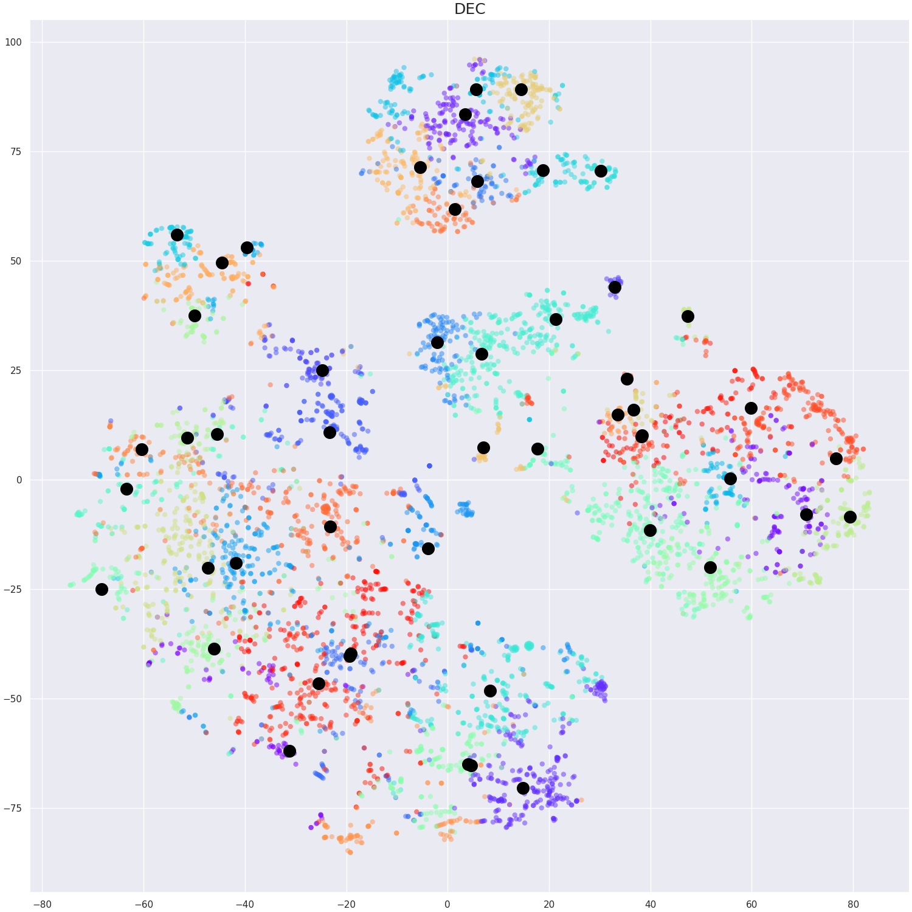
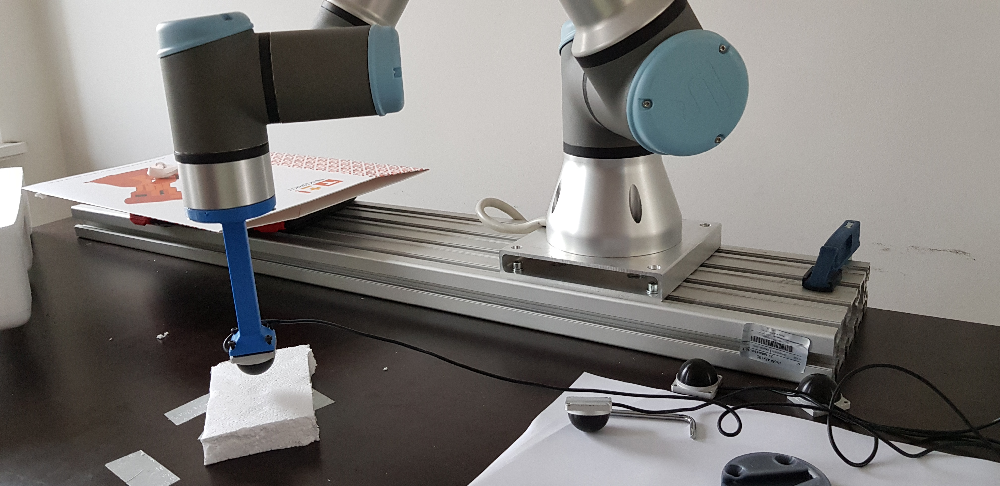

# Haptic recognition using unsupervised learning

The repository contains code and data used in the thesis titled "Combining interaction and perception to determine the
physical properties of the robot environment" by Michał Bednarek. I delved into the problem of unsupervised learning 
for the haptic recognition task, where the clustering model did not
have any prior knowledge about input signals. Typically, these algorithms analyze unlabeled datasets to group them
and discover hidden patterns. In robotics, such systems would substantially improve data association of previously
seen places, objects, or finding anomalies. However, scientific publications in that field with real-world robotic
setups are still limited, even though unsupervised learning is an emerging field of Artificial Intelligence.



## Introduction

The chapter presents results obtained from the experiments on Exploratory Data Analysis on haptic signals from different
robotics assignments using unsupervised learning methods. Typically, that kind of data analysis does not have any clear
goal and aims to find the relationship between data samples, discover clusters, and any new insights that will help to
improve data understanding. In machine learning, one of the core concepts in the EDA is the clustering
assignment that enables finding groupings in data. Experiments in the following Chapter focused on finding the best
clustering algorithm for haptic signals obtained from touching different materials or objects. All datasets involved
in investigations were primarily designed for supervised tasks, containing actual labels for each sample. The central
presumption was that the expected number of classes discovered in the data was the number of authentic classes.
Due to this, one could compare different clustering strategies based on metrics that require true labels:
clustering accuracy, normalized mutual information, and purity.

# Usage

See folder [scripts](scripts) for examples of usage.
The following example shows how to run DEC on the Touching dataset.

```bash
python python -u main.py --dataset touching --experiment dl_latent
```

## Datasets

### Touching dataset


The figure below presents the 3-axis optical force sensor OptoForce used to create
the Touching dataset. This sensor has a diameter of 32 mm, weighs 30 g, and its shapes resemble a human fingertip.
It can measure forces by utilizing optical principles. In the central part of the sensor, there is an infrared emitter
with four receivers. The semi-spherical rubber internal surface is layered with a mirroring substance. Hence,
reflections of infrared rays are highly dependent on the deformation of this hemisphere. Force measurements have three
dimensions, and the sensor's precision reaches 6.25mN. The OptoForce sensor has a nominal force capacity of 100N on
the Z-axis and 50N on the X and Y-axis, and it can be overloaded on each axis by 200\%. Again, we used the
collaborative robot UR3 to gather dataset samples. It can estimate forces and measure torques in joints, enabling us
to perform touching movements by pressing with a maximum force of 25N on the Z-axis of the robot's base coordinate
system.



### Biotac2 dataset


This dataset is an extended version of the [BIGS dataset](https://karolhausman.github.io/pdf/chebotar16-ws-icra.pdf).
The dataset follows the same structure as the original one and includes signals from it but adds 10 new classes,
yielding possible benefits in any learning-based approach, especially unsupervised learning. That version consists of
5831 raw electrode readings recorded while grasping 51 different objects' categories. Each data sample is a measurement
from three BioTac sensors mounted on a hand-like gripper. Three sensors on fingers are used to grasp objects, and each
sensor returns a signal from 24 electrodes, giving 72 measurements per grasping episode. More information available in
the corresponding [repository](https://github.com/3dperceptionlab/biotacsp-stability-set-v2).

## Evaluation metrics

* Clustering accuracy
* Mutual information
* Purity

## Adapted methods

* Deep Embedding Clustering (DEC)
* K-Means
* Spectral clustering
* Agglomerative clustering
* Gaussian Mixture Model (GMM)